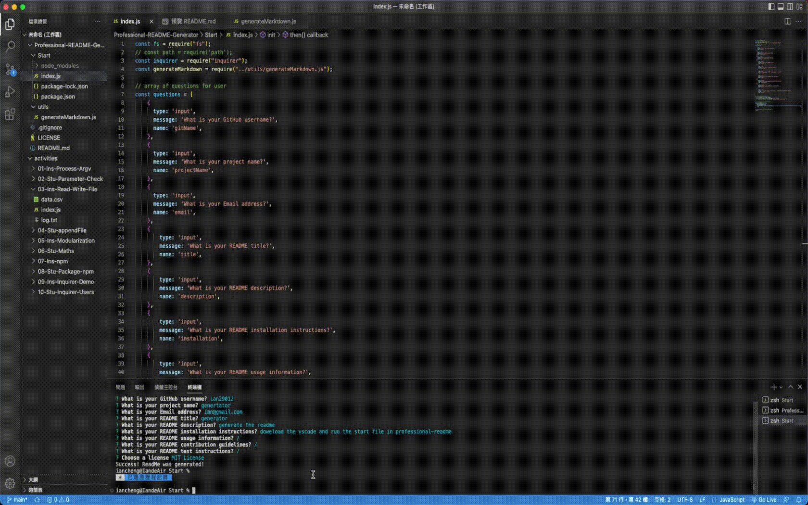

# Professional-README-Generator
  
## Table of Contents 
          
[Description](#Description)  &nbsp; | &nbsp;  [Installation](#Installation)  &nbsp; | &nbsp;  [Usage](#Usage)  &nbsp; | &nbsp;  [Contributing](#Contributing)  &nbsp; | &nbsp;  [Tests](#Tests)  
          

  
## Description
          
This application can quickly and easily create a README file by using a command-line application to generate one. This allows the project creator to devote more time to working on the project.  


## Installation
      
1. Download the Professional-README-Generator file.
2. Open with VScode.
3. Right the Start file and choose open with the terminal.
          
## Usage
      
1. Enter the ```node index``` in the terminal.
2. Enter the detail of the Readme file.
3. Done! It will be generated for you.

if you have question please review the [video of usage](https://drive.google.com/file/d/1QrN4gd6_1meVbQ78bWiYrMu1-c-5Zcvd/view)
          
## Contributing
          
[ian29012](https://github.com/ian29012)
          
          
## license
  
The ${response.license} covers this application
          
## Questions
    
Thank you for taking the time to review my project. 
Please feel free to reach my other project on [ian29012](https://github.com/ian29012)  
If you have any problem please do not hesitate to contact me with [iancheng29012@gmail.com](iancheng29012@gmail.com).